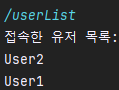
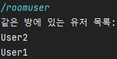
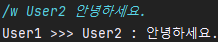
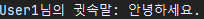
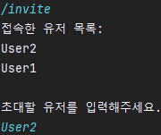
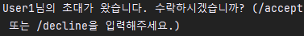
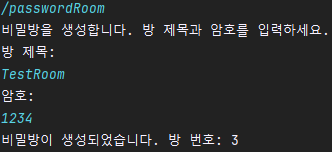
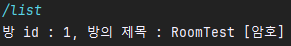
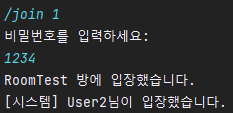
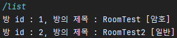

# 미니 채팅 시스템

### 1. [ 기본적인 요구사항 ](#기본적인-요구사항)

### 2. [ 채팅방 관리 기능 ](#채팅방-관리-기능)

### 3. [ 추가 기능 ](#추가-기능)

## 기본적인 요구사항

### 1. 서버 연결 및 닉네임 설정

- 클라이언트는 12345 포트로 대기 중인 `ChatServer`에 접속합니다.

- 서버에 접속하면, 사용자는 닉네임을 입력받아 서버에 전송합니다.
- 서버는 사용자의 닉네임을 받고 "OOO 닉네임의 사용자가 연결했습니다."라고 출력합니다.
- 클라이언트가 접속하면 서버는 사용자의 IP 주소를 출력합니다.

### 2. 메시지 수신 및 발신

- 클라이언트는 닉네임을 입력한 후부터 서버로부터 메시지를 한 줄씩 받아 화면에 출력합니다.

- 사용자가 메시지를 입력하면 서버에 전송합니다.

- 사용자가 "/bye"를 입력하면 연결을 종료하고 프로그램을 종료합니다. 서버도 "OOO 닉네임의 사용자가 연결을 끊었습니다."를 출력하고 연결을 종료합니다.

## 채팅방 관리 기능

### 1. 명령어 모음

- 서버는 클라이언트가 접속하면 아래 명령어들을 클라이언트에게 전송합니다:

### [!] 방에 관련된 명령어

```java
    1. 방 생성 : /create <방 이름>
    2. 비밀방 생성 : /passwordRoom
                 따로 입력할 수 있는 창이 뜨고 방 이름 및 패스워드 입력하여 비밀방 생성
    3. 방 접속 : /join <방 번호>
    4. 방 나가기 : /exit
    5. 생성된 방의 리스트 조회 : /list
```

### [!] 유저와 관련된 명령어

```java
    1. 같은 방 유저 리스트 조회 : /roomUser
    2. 유저 리스트 조회 : /userList
    3. 귓속말 : /w <유저이름> <메시지>
    4. 유저 초대 :  방 안에 들어간 상태에서
                /invite 입력시 유저의 리스트가 확인되고 초대 가능
                 초대를 받은 사용자는 /accept, /decline 을 통해 초대 수락, 거절 가능`
```

### [!] 커맨드

```java
 1. 명령어 확인 : /help
 2. 클라이언트 종료 : /quit`
```

### 2. 대화방 생성

- 클라이언트가 "/create"를 입력하면 서버는 새 방을 생성하고 클라이언트를 그 방으로 이동시킵니다.
- 방은 1부터 시작하는 번호로 관리되며, 생성 시 "방 번호 [방번호]가 생성되었습니다."를 출력합니다.

### 3. 방 목록 보기

- "/list" 명령을 입력하면 서버는 생성된 모든 방의 목록을 출력합니다.

### 4. 방 입장 및 나가기

- "/join [방번호]"를 통해 특정 방에 입장할 수 있습니다. 방에 입장하면, "닉네임이 방에 입장했습니다." 메시지를 전달합니다.
- 방에서 "/exit"를 입력하면, "닉네임이 방을 나갔습니다." 메시지와 함께 로비로 이동합니다. 방에 아무도 남지 않으면 해당 방을 삭제하고 "방 번호 [방번호]가 삭제되었습니다."를 출력합니다.

## 추가 기능

### 1. 중복 닉네임 방지

- 서버는 중복되지 않는 닉네임만 허용합니다. 이미 사용 중인 닉네임을 입력하면 경고 메시지를 보내고 다른 닉네임을 요구합니다.
  > 

### 2. 사용자 및 방 관련 정보 제공

- "/userList" 명령으로 현재 접속 중인 모든 사용자의 목록을 볼 수 있습니다.
- "/roomUser" 명령으로 현재 방에 있는 모든 사용자의 목록을 확인할 수 있습니다.
>  

### 3. 귓속말 기능

- "/w [닉네임] [메시지]" 명령을 사용하여 특정 사용자에게만 메시지를 전송할 수 있습니다. 방 내에서도 같은 명령을 사용하여 특정
닉네임에게만 메시지를 보낼 수 있습니다.
>  </br> </br>
> 귓속말을 받은 User2의 사용자 </br> 
> 

### 4. 채팅 내역 저장 기능

- 유저 간 채팅에 작성한 내용들을 파일로 만들어 채팅 내역을 확인할 수 있게 만듭니다.

### 5. 채팅방 초대 기능

- 채팅방 안에서 invite 를 입력하여 채팅방 초대가 가능합니다.
- 초대 받은 사람은 /accept 또는 /decline을 통해 채팅방 입장 또는 거절이 가능합니다.
>  </br> </br>
> 초대를 받은 사용자의 창 </br>
> 

### 6. 비밀방 생성

- /passwordRoom을 통해서 사용자가 비밀방을 만들어 일반 사용자가 들어올 수 없게 채팅방을 만듭니다.
  입력할 수 있는 커맨드 라인이 뜨고 방 이름과 패스워드 이름을 순차적으로 적으면 비밀방이 만들어집니다.
>  </br> </br>
> 생성된 후 /roomlist를 통해 방의 정보를 확인 가능 </br>
>  </br> </br>
> 비밀번호를 입력해서 채팅방에 들어가야함 </br>
> 

### 7. 방 리스트 확인

> /list 를 통해 현재 만들어져 있는 채팅방을 확인할 수 있습니다. </br>
> 
